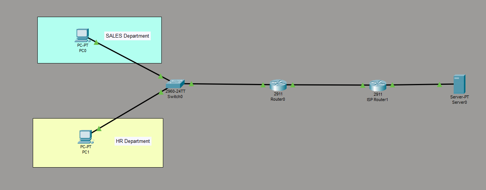
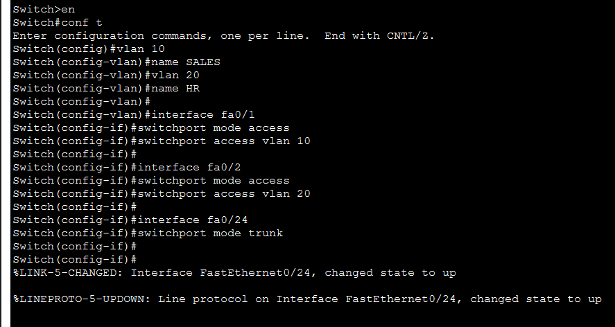
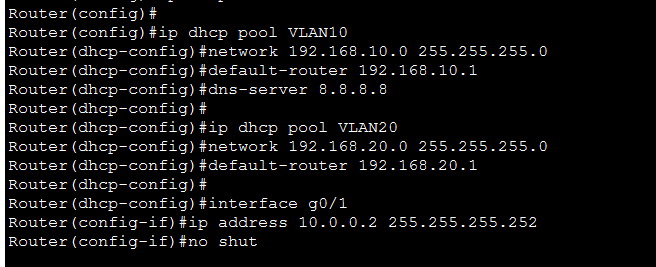
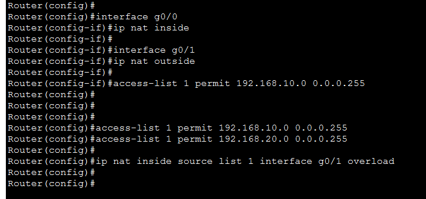
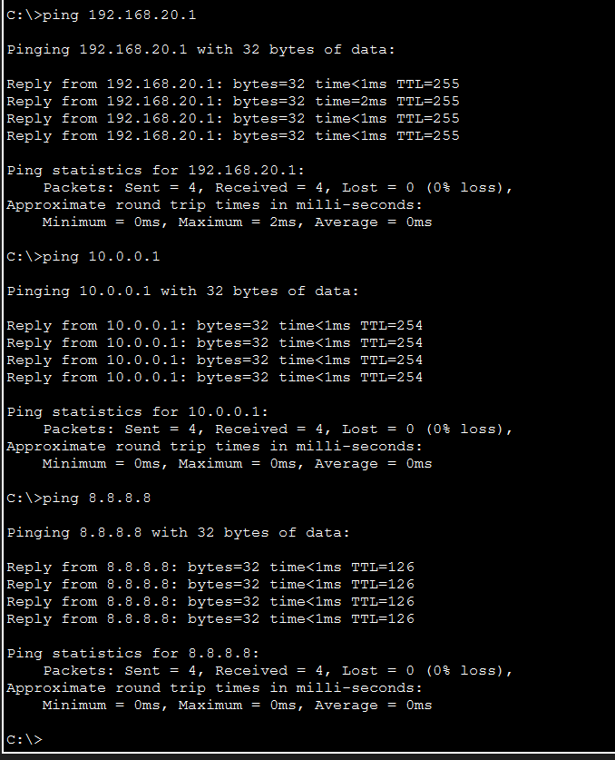

# Enterprise Network Simulation: VLAN + DHCP + NAT + Internet

A Cisco Packet Tracer project demonstrating a production-style enterprise network with VLAN segmentation, inter-VLAN routing, DHCP automation, and NAT/PAT-based internet access.

---

## Table of Contents

- [Overview](#overview)
- [Objectives](#objectives)
- [Network Design](#network-design)
- [Configuration](#configuration)
- [Testing & Verification](#testing--verification)
- [Future Improvements](#future-improvements)
- [Project Files](#project-files)

---

## Overview

This project builds a complete enterprise network simulation from the ground up. It covers departmental isolation via VLANs, automatic IP assignment through DHCP, gateway routing using Router-on-a-Stick, and internet connectivity through NAT/PAT — all simulated with a dedicated ISP router and public server.

---

## Objectives

- Segment the network into department-level VLANs
- Enable inter-VLAN communication through subinterface routing
- Automate IP addressing with DHCP pools
- Provide internet access via NAT/PAT using a single public IP
- Simulate a real ISP connection and internet server

---

## Network Design

### VLAN Topology

| VLAN | Department | Network           | Gateway       |
|------|------------|-------------------|---------------|
| 10   | Sales      | 192.168.10.0/24   | 192.168.10.1  |
| 20   | HR         | 192.168.20.0/24   | 192.168.20.1  |

### ISP / WAN Topology

| Device         | Interface | IP Address     |
|----------------|-----------|----------------|
| Router0        | G0/1      | 10.0.0.2       |
| Router1 (ISP)  | G0/0      | 10.0.0.1       |
| Router1 (ISP)  | G0/1      | 8.8.8.1        |
| Internet Server| Fa0       | 8.8.8.8        |

### Network Topology



---

## Configuration

### 1. VLAN Creation (Switch)

```bash
enable
configure terminal

vlan 10
 name SALES

vlan 20
 name HR
```

### 2. Access Port Assignment

```bash
interface fa0/1
 switchport mode access
 switchport access vlan 10

interface fa0/2
 switchport mode access
 switchport access vlan 20
```

### 3. Trunk Port Configuration

```bash
interface fa0/24
 switchport mode trunk
```

Enables tagged VLAN traffic between the switch and router.



### 4. Inter-VLAN Routing — Router-on-a-Stick

```bash
interface g0/0
 no shutdown

interface g0/0.10
 encapsulation dot1Q 10
 ip address 192.168.10.1 255.255.255.0

interface g0/0.20
 encapsulation dot1Q 20
 ip address 192.168.20.1 255.255.255.0
```

Each subinterface acts as the default gateway for its respective VLAN.

### 5. DHCP Configuration

```bash
ip dhcp excluded-address 192.168.10.1
ip dhcp excluded-address 192.168.20.1

ip dhcp pool VLAN10
 network 192.168.10.0 255.255.255.0
 default-router 192.168.10.1
 dns-server 8.8.8.8

ip dhcp pool VLAN20
 network 192.168.20.0 255.255.255.0
 default-router 192.168.20.1
 dns-server 8.8.8.8
```



### 6. WAN Interface Configuration

**Router0**
```bash
interface g0/1
 ip address 10.0.0.2 255.255.255.252
 no shutdown
```

**Router1 (ISP)**
```bash
interface g0/0
 ip address 10.0.0.1 255.255.255.252
 no shutdown

interface g0/1
 ip address 8.8.8.1 255.255.255.0
 no shutdown
```

### 7. NAT/PAT Configuration

```bash
interface g0/0
 ip nat inside

interface g0/1
 ip nat outside

access-list 1 permit 192.168.10.0 0.0.0.255
access-list 1 permit 192.168.20.0 0.0.0.255

ip nat inside source list 1 interface g0/1 overload
```

All internal hosts share the single public IP on G0/1 via Port Address Translation.



### 8. Static Routing

**Router0**
```bash
ip route 0.0.0.0 0.0.0.0 10.0.0.1
```

**Router1 (ISP)**
```bash
ip route 192.168.10.0 255.255.255.0 10.0.0.2
ip route 192.168.20.0 255.255.255.0 10.0.0.2
```

---

## Testing & Verification

### Verify DHCP Lease

Run on any PC:
```
ipconfig
```

### Connectivity Tests

```
ping 192.168.20.1    # Inter-VLAN gateway
ping 10.0.0.1        # ISP router
ping 8.8.8.8         # Internet server
```

### Expected Results

| Test                   | Result     |
|------------------------|------------|
| Inter-VLAN communication | ✅ Pass  |
| Router reachability    | ✅ Pass    |
| ISP connectivity       | ✅ Pass    |
| Internet simulation    | ✅ Pass    |
| NAT/PAT translation    | ✅ Pass    |



---

## Future Improvements

- Access Control Lists (ACLs) for traffic filtering between VLANs
- Firewall integration at the WAN boundary
- OSPF or EIGRP to replace static routing
- Layer 3 switch to handle inter-VLAN routing without a dedicated router

---

## Project Files

```
vlan_dhcp_nat_internet.pkt    # Packet Tracer topology
/images                                 # Screenshots
README.md                               # This document
```

---

## Author

**Hasitha Ramesh**  
GitHub: [github.com/hasitha-ramesh](https://github.com/hasitha-ramesh)
